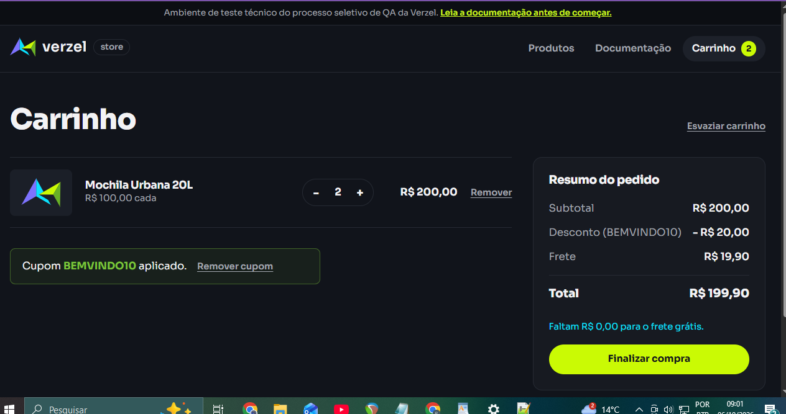
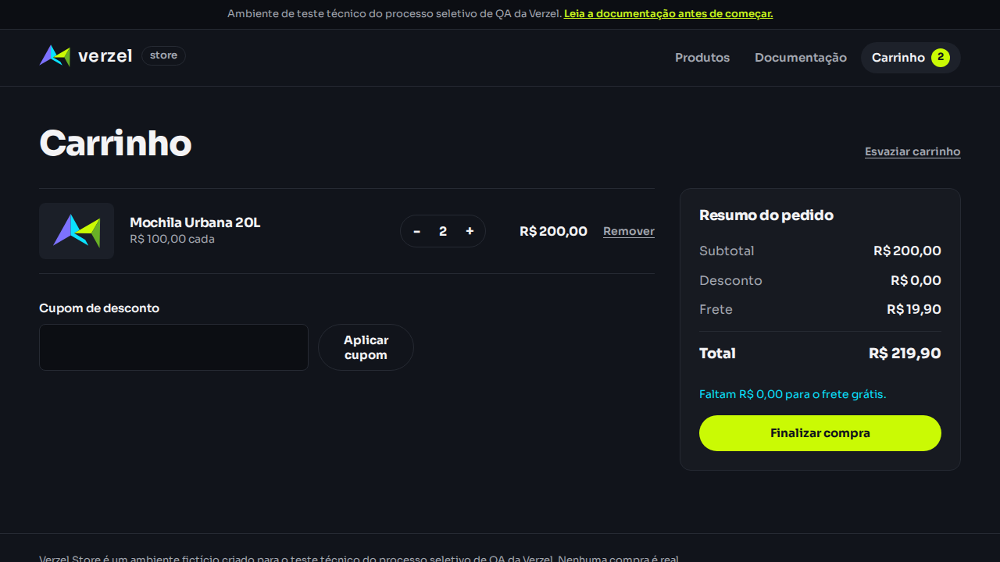

# Relatório de bugs — Verzel Store

Card: VZS-142
Versão documentada: 2.3.0
Execução: 06/10/2026
Endpoint: POST /api/carrinho/calcular

## BUG-001 — Frete cobrado com subtotal de R$ 200,00

- Critério violado: CA06.
- Severidade sugerida: média.
- Status: reproduzido na API.

### Reprodução
Enviar duas unidades de P005 ao endpoint de cálculo.
Repetir com o cupom BEMVINDO10.

### Esperado
Sem cupom: subtotal 200, frete 0, freteGratis true e total 200.
Com cupom: desconto 20, frete 0 e total 180.

### Observado
Sem cupom: frete 19.9, freteGratis false e total 219.9.
Com cupom: frete 19.9, freteGratis false e total 199.9.
Nos dois casos, valorFaltanteFreteGratis é zero.

### Impacto
Cobrança indevida de R$ 19,90 no limite de elegibilidade.

### Evidências
- [Sem cupom](../evidencias/api/subtotal-200-sem-cupom.json)
- [Com cupom](../evidencias/api/subtotal-200-com-cupom.json)
- [Controle acima do limite](../evidencias/api/subtotal-22990-com-cupom.json)

### Observações
O controle de R$ 229,90 com cupom retornou frete grátis.
A causa interna não foi verificada.
CA08 ainda precisa de teste separado com subtotal acima de R$ 200
e valor após desconto abaixo desse limite.

## BUG-002 — API aceita seis unidades do mesmo produto

- Critério violado: CA10.
- Severidade sugerida: média.
- Status: reproduzido na API.

### Reprodução
Enviar um item com produtoId P005 e quantidade 6 ao endpoint de cálculo.

### Esperado
HTTP 422 com erro.codigo QUANTIDADE_MAXIMA_EXCEDIDA.

### Observado
HTTP 200, quantidade 6, subtotal 600 e total 600.

### Impacto
O cálculo aceita quantidade superior ao limite documentado.

### Evidência
- [Requisição e resposta](../evidencias/api/quantidade-6.json)

### Observações
Interface e endpoint de pedidos ainda não foram verificados.

## Confirmação manual do BUG-001 na interface

Data: 06/10/2026.
Carrinho: duas unidades de P005, sem cupom.

- Subtotal observado: R$ 200,00.
- Frete observado: R$ 19,90.
- Total observado: R$ 219,90.
- Esperado: frete grátis e total de R$ 200,00.
- Resultado: reprovado — BUG-001.

### Confirmação manual do BUG-001 com cupom

Data: 06/10/2026.
Carrinho: duas unidades de P005.
Cupom: BEMVINDO10.

| Campo | Esperado | Observado |
|---|---:|---:|
| Subtotal | R$ 200,00 | R$ 200,00 |
| Desconto | R$ 20,00 | R$ 20,00 |
| Frete | R$ 0,00 | R$ 19,90 |
| Total | R$ 180,00 | R$ 199,90 |

Resultado: reprovado — BUG-001.

O desconto e a soma estão corretos. A divergência é a cobrança
de frete quando o subtotal atende ao limite inclusivo do CA06.

### Captura da interface com cupom

# Execução manual — Verzel Store

Data: 06/10/2026.
Referência: VZS-142, versão documentada 2.3.0.

| ID | Cenário | Esperado | Observado | Resultado |
|---|---|---|---|---|
| CT-M01 | 2 P005 sem cupom: subtotal R$ 200,00 | Frete grátis; total R$ 200,00 | Frete R$ 19,90; total R$ 219,90 | Reprovado — BUG-001 |
| CT-M02 | 2 P005 com BEMVINDO10 | Desconto R$ 20,00; frete grátis; total R$ 180,00 | Desconto R$ 20,00; frete R$ 19,90; total R$ 199,90 | Reprovado — BUG-001 |
| CT-M03 | 3 P001 + 1 P006 sem cupom | Subtotal R$ 209,60; frete grátis; total R$ 209,60 | Conforme esperado | Aprovado |
| CT-M04 | 3 P001 + 1 P006 com BEMVINDO10 — CA08 | Desconto R$ 20,96; frete grátis; total R$ 188,64 | Conforme esperado | Aprovado |

### Reprodução automatizada do BUG-001 na interface

Execução em 06/10/2026 com Playwright e Chromium.
O teste esperava frete grátis com subtotal de R$ 200,00,
mas a interface exibiu R$ 19,90.

[Trace da execução](../evidencias/automacao-ui/bug-001-trace.zip)

## Ampliação do BUG-002 — Confirmação de pedido com seis unidades

Data: 06/10/2026.
Endpoint: POST /api/pedidos.
Teste: API11 em tests/api/validacoes.spec.js.
Critério violado: CA10.

### Reprodução
Enviar cliente válido e um item com produtoId P005 e quantidade 6.

### Esperado
HTTP 422 com erro.codigo QUANTIDADE_MAXIMA_EXCEDIDA.

### Observado
HTTP 201, indicando confirmação do pedido.

### Impacto
O limite de cinco unidades é respeitado pela interface, mas pode
ser ultrapassado pela API tanto no cálculo quanto na confirmação.

### Evidência
Requisição e resposta anexadas ao teste API11 no relatório consolidado:
evidencias/execucao-consolidada/playwright-report/index.html.

Esta ocorrência complementa o BUG-002; não representa um terceiro bug.